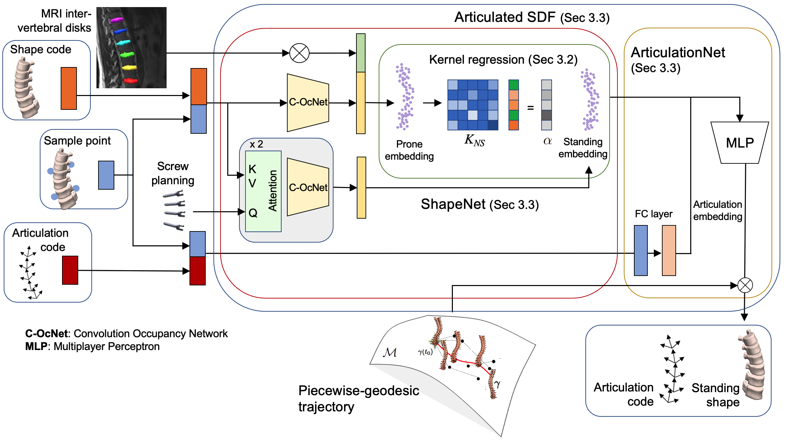

# spineA-SDF

We propose a framework used in the operating room (OR) forecasting the upright spine geometry at the first visit following surgery in idiopathic scoliosis patients. The approach first creates a 3D model of the spine while the patient is on the operating table. For this, multiview Transformers that combine images from different viewpoints are used to generate the intra-operative pose. The post-operative upright shape is predicted on-the-fly using implicit neural fields, which are trained from geometries at different time points and conditioned with surgical parameters. A Signed Distance Function for shape constellations is used to handle the variability in spine appearance, capturing in a disentangled latent space the articulation vectors, with separate encoding vectors representing both articulation and shape parameters. A regularization criterion enables smooth outputs by using a pre-trained group-wise trajectory of spine transformations. 

## Description

This is the code for spineA-SDF: 3D Gaussian Splats from Image Pairs for Scalable Generalizable 3D Reconstruction by Sylvain Thibeauly, Stefan Parent and Samuel Kadoury.

<p align="center">
  
</p>


## Getting Started

### Dependencies

* Describe any prerequisites, libraries, OS version, etc., needed before installing program.
* ex. Windows 10

### Installing

*  spineA-SDF can be simply installed via pip:
```
$ pip install spineA-SDF
```
### Executing program

Code to come...

## Help

Any advise for common problems or issues.
```
command to run if program contains helper info
```

## Authors

Sylvain Thibeault  
Samuel Kadoury

## Version History

* 0.2
    * Various bug fixes and optimizations
    * See [commit change]() or See [release history]()
* 0.1
    * Initial Release

## License

This project is licensed under the Create Common License 4.0 - see the LICENSE.md file for details

## Acknowledgments

The work is based on [awesome-readme](https://github.com/matiassingers/awesome-readme), [dbader](https://github.com/dbader/readme-template) and XMem. Thanks for the open source contributions to these efforts!

